# AIOProducer Class Diagram

## Overview
This document presents the class diagram for the `confluent_kafka.aio.producer` module, showcasing the clean, layered architecture with unified callback management.

## Class Diagram

```mermaid
classDiagram
    %% ========================================================================
    %% CORE ORCHESTRATION LAYER
    %% ========================================================================
    class AIOProducer {
        -_loop: asyncio.EventLoop
        -_producer: confluent_kafka.Producer
        -_callback_manager: CallbackManager
        -_kafka_executor: KafkaBatchExecutor
        -_batch_processor: ProducerBatchProcessor
        -_buffer_timeout_manager: BufferTimeoutManager
        -_batch_size: int
        -_is_closed: bool
        +__init__(producer_conf, max_workers, executor, batch_size, buffer_timeout)
        +async close()
        +async produce(topic, value, key, **kwargs) Future
        +async flush(**kwargs)
        +async purge(**kwargs)
        +async poll(timeout, **kwargs)
        +get_callback_manager_stats() dict
        +create_batches_preview(target_topic) List[MessageBatch]
        +async init_transactions(**kwargs)
        +async begin_transaction(**kwargs)
        +async commit_transaction(**kwargs)
        +async abort_transaction(**kwargs)
        +async set_sasl_credentials(**kwargs)
        -async _flush_buffer(target_topic)
        -_handle_user_callback(callback, err, msg)
        -async _call(blocking_task, *args, **kwargs)
    }

    %% ========================================================================
    %% MESSAGE PROCESSING LAYER
    %% ========================================================================
    class ProducerBatchProcessor {
        -_callback_manager: CallbackManager
        -_kafka_executor: KafkaBatchExecutor
        -_message_buffer: List[dict]
        -_buffer_futures: List[Future]
        +__init__(callback_manager, kafka_executor)
        +add_message(msg_data, future)
        +get_buffer_size() int
        +is_buffer_empty() bool
        +clear_buffer()
        +create_batches(target_topic) List[MessageBatch]
        +async flush_buffer(target_topic)
        +get_callback_manager_stats() dict
        -_group_messages_by_topic() dict
        -_prepare_batch_messages(messages) List[dict]
        -_assign_callbacks_to_messages(batch_messages, futures, callbacks)
        -_handle_batch_failure(exception, futures, callbacks)
        -_clear_topic_from_buffer(target_topic)
    }

    %% ========================================================================
    %% KAFKA OPERATIONS LAYER
    %% ========================================================================
    class KafkaBatchExecutor {
        -_producer: confluent_kafka.Producer
        -_executor: ThreadPoolExecutor
        +__init__(producer, executor)
        +async execute_batch(topic, batch_messages) int
        -_handle_partial_failures(batch_messages)
    }

    %% ========================================================================
    %% TIMEOUT MANAGEMENT LAYER
    %% ========================================================================
    class BufferTimeoutManager {
        -_batch_processor: ProducerBatchProcessor
        -_kafka_executor: KafkaBatchExecutor
        -_timeout: float
        -_last_activity: float
        -_timeout_task: Task
        -_running: bool
        +__init__(batch_processor, kafka_executor, timeout)
        +mark_activity()
        +start_timeout_monitoring()
        +stop_timeout_monitoring()
        -async _monitor_timeout()
        -async _flush_buffer_due_to_timeout()
        -_create_batches_for_timeout_flush() List[MessageBatch]
    }

    %% ========================================================================
    %% UNIFIED CALLBACK MANAGEMENT LAYER
    %% ========================================================================
    class CallbackManager {
        -_loop: asyncio.EventLoop
        -_available: List[ReusableMessageCallback]
        -_in_use: Set[ReusableMessageCallback]
        -_created_count: int
        -_reuse_count: int
        +__init__(loop, initial_pool_size)
        +handle_user_callback(callback, err, msg)
        +get_callback(future, user_callback) ReusableMessageCallback
        +return_callback(callback)
        +get_stats() dict
    }

    class ReusableMessageCallback {
        +future: Future
        +user_callback: callable
        +pool: CallbackManager
        +__init__()
        +reset(future, user_callback, pool)
        +__call__(err, msg)
        -_clear_and_return()
    }

    %% ========================================================================
    %% DATA STRUCTURES LAYER
    %% ========================================================================
    class MessageBatch {
        <<namedtuple>>
        +topic: str
        +messages: tuple
        +futures: tuple
        +callbacks: tuple
        +size: property
        +info: property
    }

    class create_message_batch {
        <<function>>
        +create_message_batch(topic, messages, futures, callbacks) MessageBatch
    }

    %% ========================================================================
    %% EXTERNAL DEPENDENCIES
    %% ========================================================================
    class confluent_kafka_Producer {
        <<external>>
        +produce_batch(topic, messages)
        +poll(timeout) int
        +flush(**kwargs)
        +purge(**kwargs)
    }

    class ThreadPoolExecutor {
        <<external>>
        +submit(fn, *args, **kwargs) Future
        +shutdown(wait)
    }

    class asyncio_EventLoop {
        <<external>>
        +call_soon_threadsafe(callback)
        +create_task(coroutine)
        +run_in_executor(executor, func, *args)
    }

    %% ========================================================================
    %% RELATIONSHIPS - COMPOSITION (STRONG OWNERSHIP)
    %% ========================================================================
    AIOProducer *-- CallbackManager : creates
    AIOProducer *-- KafkaBatchExecutor : creates
    AIOProducer *-- ProducerBatchProcessor : creates
    AIOProducer *-- BufferTimeoutManager : creates
    
    CallbackManager *-- ReusableMessageCallback : manages pool of
    
    %% ========================================================================
    %% RELATIONSHIPS - DEPENDENCY INJECTION (WEAK COUPLING)
    %% ========================================================================
    ProducerBatchProcessor --> CallbackManager : injected
    ProducerBatchProcessor --> KafkaBatchExecutor : injected
    BufferTimeoutManager --> ProducerBatchProcessor : injected
    BufferTimeoutManager --> KafkaBatchExecutor : injected
    
    %% ========================================================================
    %% RELATIONSHIPS - USAGE AND DATA FLOW
    %% ========================================================================
    ProducerBatchProcessor ..> MessageBatch : creates
    ProducerBatchProcessor ..> create_message_batch : uses
    BufferTimeoutManager ..> MessageBatch : creates via processor
    ReusableMessageCallback --> CallbackManager : returns to pool
    
    %% ========================================================================
    %% EXTERNAL DEPENDENCIES
    %% ========================================================================
    AIOProducer --> confluent_kafka_Producer : wraps
    AIOProducer --> ThreadPoolExecutor : uses
    AIOProducer --> asyncio_EventLoop : uses
    KafkaBatchExecutor --> confluent_kafka_Producer : executes on
    KafkaBatchExecutor --> ThreadPoolExecutor : runs in
    CallbackManager --> asyncio_EventLoop : schedules on

    %% ========================================================================
    %% STYLING
    %% ========================================================================
    classDef coreLayer fill:#e1f5fe,stroke:#01579b,stroke-width:3px
    classDef processingLayer fill:#f3e5f5,stroke:#4a148c,stroke-width:2px
    classDef kafkaLayer fill:#e8f5e8,stroke:#1b5e20,stroke-width:2px
    classDef timeoutLayer fill:#fff3e0,stroke:#e65100,stroke-width:2px
    classDef callbackLayer fill:#ffebee,stroke:#b71c1c,stroke-width:2px
    classDef dataLayer fill:#f1f8e9,stroke:#33691e,stroke-width:2px
    classDef externalLayer fill:#f5f5f5,stroke:#424242,stroke-width:1px,stroke-dasharray: 5 5

    class AIOProducer coreLayer
    class ProducerBatchProcessor processingLayer
    class KafkaBatchExecutor kafkaLayer
    class BufferTimeoutManager timeoutLayer
    class CallbackManager callbackLayer
    class ReusableMessageCallback callbackLayer
    class MessageBatch dataLayer
    class create_message_batch dataLayer
    class confluent_kafka_Producer externalLayer
    class ThreadPoolExecutor externalLayer
    class asyncio_EventLoop externalLayer
```



## Architecture Layers

### 🔵 Core Orchestration Layer
- **AIOProducer**: Main async producer API and orchestration hub
- **Role**: Public interface, component coordination, lifecycle management
- **Dependencies**: All other layers

### 🟣 Message Processing Layer
- **ProducerBatchProcessor**: Message batching and organization logic
- **Role**: Buffer management, topic grouping, batch creation
- **Dependencies**: CallbackManager, KafkaBatchExecutor

### 🟢 Kafka Operations Layer
- **KafkaBatchExecutor**: Kafka operations and thread pool management
- **Role**: Execute produce_batch, handle partial failures, thread safety
- **Dependencies**: confluent_kafka.Producer, ThreadPoolExecutor

### 🟠 Timeout Management Layer
- **BufferTimeoutManager**: Automatic buffer timeout and flushing
- **Role**: Activity monitoring, timeout detection, automatic flushes
- **Dependencies**: ProducerBatchProcessor, KafkaBatchExecutor

### 🔴 Unified Callback Management Layer
- **CallbackManager**: Unified callback execution and object pooling
- **ReusableMessageCallback**: Pooled callback objects for performance
- **Role**: Sync/async callback handling, performance optimization
- **Dependencies**: asyncio.EventLoop

### 🟡 Data Structures Layer
- **MessageBatch**: Immutable value object for batch data
- **create_message_batch**: Factory function for creating batches
- **Role**: Type-safe data containers, immutability guarantees

## Component Statistics

| Layer | Components | Responsibilities |
|-------|------------|-----------------|
| **Core** | 1 | API, orchestration, lifecycle |
| **Processing** | 1 | Batching, buffering, organization |
| **Kafka Ops** | 1 | Thread pool execution, produce_batch |
| **Timeout** | 1 | Activity monitoring, auto-flush |
| **Callbacks** | 2 | Execution + pooling (unified) |
| **Data** | 2 | Value objects, factory functions |
| **Total** | **7** | **Clean, focused responsibilities** |

## Key Design Patterns

### 🏗️ **Layered Architecture**
- Clear separation of concerns across logical layers
- Dependencies flow downward (no circular dependencies)
- Each layer has a specific, focused responsibility

### 🔌 **Dependency Injection**
- Components receive dependencies via constructor
- Enables easy testing with mocks
- Reduces coupling between components

### 🎭 **Strategy Pattern**
- CallbackManager handles both sync and async callbacks
- KafkaBatchExecutor abstracts Kafka operations
- Enables different execution strategies

### 🏭 **Factory Pattern**
- `create_message_batch()` creates immutable MessageBatch objects
- Ensures consistent object creation
- Type safety and validation

### 🔄 **Object Pool Pattern**
- ReusableMessageCallback objects are pooled for performance
- Reduces allocation overhead and GC pressure
- Automatic return-to-pool via callback lifecycle

### 📦 **Value Object Pattern**
- MessageBatch is immutable and self-contained
- Groups related data (topic, messages, futures, callbacks)
- Prevents data inconsistency bugs

## Data Flow

```
1. AIOProducer.produce() 
   ↓
2. ProducerBatchProcessor.add_message()
   ↓
3. ProducerBatchProcessor.create_batches() → MessageBatch
   ↓
4. KafkaBatchExecutor.execute_batch()
   ↓
5. confluent_kafka.Producer.produce_batch()
   ↓
6. ReusableMessageCallback.__call__() (from librdkafka)
   ↓
7. CallbackManager.handle_user_callback()
   ↓
8. User callback execution (sync/async)
```

## Benefits of This Architecture

### ✅ **Single Responsibility Principle**
Each component has one clear, focused responsibility

### ✅ **Loose Coupling**
Components depend on abstractions, not concrete implementations

### ✅ **High Cohesion**
Related functionality is grouped together (e.g., CallbackManager)

### ✅ **Immutable Data**
MessageBatch prevents accidental mutations and data corruption

### ✅ **Performance Optimized**
Object pooling reduces allocation overhead

### ✅ **Thread Safe**
Proper handling of librdkafka callbacks from C threads

### ✅ **Testable**
Clean interfaces enable comprehensive unit testing

### ✅ **Maintainable**
Clear separation makes changes safe and predictable

---

*This architecture represents a production-ready, scalable async Kafka producer with clean separation of concerns and optimal performance characteristics.*
